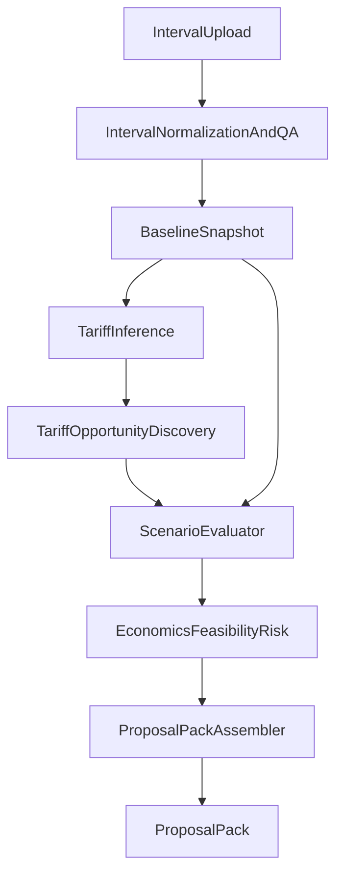

# Phase 1 Technical Spec — Battery + Tariff Intelligence (World-Class)

Status: Draft (Deliverable #1 — **no production code changes required**)  
Scope: Battery + Tariff Intelligence only (no HVAC, Monitoring, Academy, Reports beyond Phase 1 needs)  
Non‑negotiables: deterministic + reproducible, AI is assistive only, no mutation of confirmed truth, outputs are ProposalPacks

---

## 0) Objective (Phase 1)

Build a deterministic engine that can:

1) infer the customer’s current tariff with high confidence (or surface uncertainty),  
2) discover *all* “Option‑S‑like” tariff opportunities (rate switches, modifiers, eligibility‑triggered options, program interactions) relevant to the customer,  
3) evaluate each opportunity with:
   - **no-dispatch** (structural tariff savings only) and
   - **dispatch** (operational savings),
4) rank and explain viable strategies with auditable math, assumptions, evidence requirements, and risk/confidence.

---

## 1) Determinism & Trust Model (Hard Requirements)

### 1.1 Determinism
Same inputs → same outputs:
- **All billing math is deterministic** (no AI in billing/eligibility/dispatch).
- **All tariff models are versioned** (tariff library version + scenario version).
- **All optimization runs are deterministic** given identical inputs and solver version/config.
- All randomness is forbidden unless explicitly seeded and recorded (Phase 1: avoid randomness entirely).

### 1.2 “Confirmed Graph” vs “Proposal World”
- Engines **must not mutate** any confirmed building/project truth.
- Engine output is always a `ProposalPack` that can be reviewed, accepted/rejected, and logged.

### 1.3 AI boundaries (allowed vs disallowed)
- Allowed: tariff text parsing into candidates, explanation drafting, missing-info detection, UI assistance.
- Disallowed: deciding billing determinants, eligibility, dispatch, or ranking math.

---

## 2) System Architecture (Phase 1)

### 2.1 Module boundaries (required)
1. Interval normalization + data QA  
2. Billing Engine (deterministic bill + determinants)  
3. Battery Physics model (SOC, power limits, efficiency)  
4. Dispatch Optimizer (LP/MILP) — minimize bill  
5. Tariff Opportunity Discovery Engine (scenario generation + eligibility)  
6. Scenario Evaluator:
   - no-dispatch case
   - dispatch case  
7. Economics + feasibility + risk/confidence scoring  
8. ProposalPack assembler (explainability + audit trace)

### 2.2 Existing code we will align with (informative, not binding)
- Deterministic tariff engine: `src/modules/tariffEngine/*` (schemas + billing + identification scaffolding)
- Battery dispatch + Option S LP optimizer: `src/modules/battery/dispatch.ts`, `src/modules/battery/option-s-optimizer.ts`
- S-Rate eligibility helper: `src/utils/rates/s-rate-eligibility.ts`

### 2.3 High-level data flow



---

## 3) Data Contracts (Schemas)

**Schema format rule (Phase 1):** author contracts as TypeScript interfaces (optionally mirrored as Zod schemas) with explicit units and versioning.

### 3.1 Common primitives

```ts
export type ISODateTime = string; // ISO-8601, always UTC unless explicitly local
export type IANATimezone = string; // e.g. "America/Los_Angeles"
export type CurrencyCode = 'USD';

export type Quantity = {
  value: number;
  unit:
    | 'kW'
    | 'kWh'
    | 'kW_day'
    | 'kW_month'
    | 'USD'
    | 'USD_per_kW_day'
    | 'USD_per_kW_month'
    | 'USD_per_kWh'
    | 'pct';
};

export type EvidenceRef = {
  kind: 'interval_data' | 'bill_pdf' | 'utility_portal_export' | 'single_line' | 'battery_cut_sheet' | 'interconnection' | 'other';
  uri?: string;        // file path, object storage key, etc.
  note?: string;
};
```

### 3.2 `TariffModel` (charges, TOU windows, tiers, determinants, eligibility metadata)

**Goal:** represent a billing schedule as deterministic math + metadata.

```ts
export type TouWindow = {
  name: string;
  // minutes since midnight in local time (0..1440)
  startMinute: number;
  endMinute: number;
  days: 'all' | 'weekday' | 'weekend';
  season?: 'all' | 'summer' | 'winter';
};

export type DemandTier = {
  upToKw?: number;        // undefined means infinity
  pricePerKw: number;     // USD per kW in this tier
};

export type DemandDeterminant = {
  id: string;
  name: string;
  kind: 'peak' | 'part_peak' | 'off_peak' | 'facilities' | 'daily' | 'monthly' | 'custom';
  windows?: TouWindow[];  // if omitted => all intervals in cycle
  tiers: DemandTier[];
  ratchet?: {
    lookbackCycles: number;   // e.g. 12
    percent: number;          // 0..1
    appliesToDeterminantId: string;
  };
};

export type EnergyCharge = {
  id: string;
  season: 'all' | 'summer' | 'winter';
  windows: TouWindow[];
  pricePerKwh: number; // USD/kWh
};

export type TariffEligibilityMeta = {
  utility: 'PG&E' | 'SCE' | 'SDG&E' | 'Other';
  territory?: string;          // deterministic mapping key used by discovery
  customerClass?: 'C&I' | 'Residential' | 'Other';
  notes?: string;
  // Optional “eligibility requirements” for base schedule (not options).
  requirements?: Array<{
    id: string;
    description: string;
    evidenceRequirements: EvidenceRef[];
  }>;
};

export type TariffModel = {
  version: string;     // tariff library version string (e.g. "pge-2025.01")
  tariffId: string;    // globally unique id (e.g. "pge:B19")
  rateCode: string;    // human schedule code (e.g. "B-19")
  timezone: IANATimezone;
  fixedMonthlyChargeUsd?: number;
  energyCharges: EnergyCharge[];
  demandDeterminants: DemandDeterminant[];
  meta: TariffEligibilityMeta;
};
```

### 3.3 `TariffOption` (modifier/option/program)

**Goal:** encode “Option‑S‑like” constructs as deterministic rule objects:
- `trigger_conditions`: when to consider generating this option (cheap checks)
- `eligibility_rules`: deterministic boolean + missing-info reporting
- `billing_transform`: describes how to transform the billing model to create a scenario
- `required_assets`: what physical/project assets are required
- `evidence_requirements`: what proof is required to treat as “viable”
- `explain_text`: human‑readable explanation (static + templated)

```ts
export type MissingInfoItem = {
  id: string;
  title: string;
  whyNeeded: string;
  howToGet: string;
  evidence?: EvidenceRef[];
  severity: 'blocker' | 'important' | 'nice_to_have';
};

export type DeterministicRuleResult = {
  passed: boolean;
  confidence: number;       // 0..1, deterministic mapping (not ML)
  reasons: string[];        // deterministic, auditable strings
  missingInfo: MissingInfoItem[];
  evidenceUsed: EvidenceRef[];
};

export type TariffOptionKind =
  | 'rate_switch'           // switch base schedule
  | 'tariff_modifier'       // modifies determinants/charges within same schedule family
  | 'eligibility_trigger'   // unlocks alternate billing regime via asset/install
  | 'program_interaction';  // DR/other program interaction that changes billing

export type TariffOption = {
  optionId: string;         // e.g. "pge:option_s"
  version: string;          // version of rule definition
  kind: TariffOptionKind;
  name: string;
  utility: TariffEligibilityMeta['utility'];

  trigger_conditions: (baseline: BaselineSnapshot) => boolean;
  eligibility_rules: (baseline: BaselineSnapshot, candidateAssets: CandidateAssets) => DeterministicRuleResult;

  billing_transform: (base: TariffModel, baseline: BaselineSnapshot, candidateAssets: CandidateAssets) => {
    transformedTariff: TariffModel;
    transformNotes: string[];   // exact diff narrative for audit
  };

  required_assets: Array<{
    id: string;
    description: string;
  }>;

  evidence_requirements: Array<{
    id: string;
    description: string;
    required: boolean;
    evidence: EvidenceRef[];
  }>;

  explain_text: {
    summary: string;
    details: string[]; // bullet points, deterministic templates allowed
  };
};
```

### 3.4 `RateScenario` (TariffModel + applied options/modifiers)

```ts
export type RateScenario = {
  scenarioId: string;       // stable id derived from (tariffId + optionIds + params)
  version: string;          // engine version / scenario schema version
  baseTariffId: string;
  appliedOptionIds: string[]; // ordered, deterministic
  tariff: TariffModel;
  scenarioNotes: string[];  // why scenario exists + how it differs
  eligibility: DeterministicRuleResult; // aggregated result
};
```

### 3.5 `BaselineSnapshot` (intervals + customer attributes needed for eligibility)

```ts
export type IntervalPoint = {
  timestamp: ISODateTime; // normalized
  kw: number;             // site demand kW
};

export type DataQuality = {
  intervalMinutes: number;    // expected 15 for Phase 1
  timezone: IANATimezone;
  coveragePct: number;        // 0..1
  gapsCount: number;
  outliersCount: number;
  notes: string[];
  confidence: number;         // deterministic score 0..1
  evidenceUsed: EvidenceRef[];
};

export type TariffInference = {
  detectedRateCode?: string;  // if found
  detectedTariffId?: string;
  confidence: number;         // 0..1
  why: string[];
  missingInfo: MissingInfoItem[];
  evidenceUsed: EvidenceRef[];
};

export type BaselineSnapshot = {
  snapshotId: string;           // stable id or hash of normalized inputs
  createdAt: ISODateTime;
  timezone: IANATimezone;

  territory: {
    utility: TariffEligibilityMeta['utility'];
    serviceAccountId?: string;
    rateCodeFromBill?: string;  // if provided by user/doc
  };

  intervals: IntervalPoint[];
  billingPeriods?: Array<{
    cycleId: string;
    billStartDate: ISODateTime;
    billEndDate: ISODateTime;
    statedTotalBillUsd?: number;
    rateCode?: string;
  }>;

  derived: {
    peakKw_12mo?: number;
    avgKw?: number;
    loadFactor?: number;        // avg/peak
  };

  dataQuality: DataQuality;
  tariffInference: TariffInference;

  assumptions: Array<{
    id: string;
    text: string;
    confidence: number;         // deterministic (e.g. 0.2 if guessed)
    evidenceUsed: EvidenceRef[];
  }>;
};
```

### 3.6 `ProposalPack` (ranked strategies; structural vs operational; assumptions; confidence; risks)

```ts
export type DispatchMode = 'no_dispatch' | 'optimized_dispatch';

export type BatterySpec = {
  powerKw: number;
  energyKwh: number;
  roundTripEfficiency: number; // 0..1
  minSocFrac?: number;
  maxSocFrac?: number;
};

export type CandidateAssets = {
  battery?: BatterySpec;
  // Phase 1 keeps this small; future: PV, gen, EVSE, etc.
};

export type BillBreakdown = {
  totalUsd: number;
  energyUsd?: number;
  demandUsd?: number;
  fixedUsd?: number;
  determinants?: Array<{
    determinantId: string;
    name: string;
    beforeKw?: number;
    afterKw?: number;
    bindingTimestampsBefore?: ISODateTime[];
    bindingTimestampsAfter?: ISODateTime[];
  }>;
  notes: string[];
};

export type AuditTrace = {
  engineVersion: string;
  tariffLibraryVersion: string;
  inputsHash: string; // hash of BaselineSnapshot + scenario + candidateAssets + solver config
  solver?: {
    name: string;         // e.g. "glpk.js"
    version?: string;
    status?: string;
  };
  steps: Array<{
    stepId: string;
    title: string;
    inputs: Record<string, unknown>;
    outputs: Record<string, unknown>;
    evidenceUsed: EvidenceRef[];
  }>;
};

export type StrategyResult = {
  strategyId: string;
  title: string;
  summary: string;

  scenario: RateScenario;
  candidateAssets: CandidateAssets;

  evaluation: {
    noDispatch: {
      baselineBill: BillBreakdown;
      scenarioBill: BillBreakdown;           // with transformed tariff, same load
      structuralSavingsUsd: number;          // scenarioBill - baselineBill attributable to tariff change only
      operationalSavingsUsd: 0;              // explicitly 0 for no-dispatch
    };
    dispatch: {
      baselineBill: BillBreakdown;           // baseline tariff, baseline load (no battery)
      optimizedBill: BillBreakdown;          // scenario tariff, optimized net load
      structuralSavingsUsd: number;          // tariff change component (baseline tariff vs scenario tariff, same load)
      operationalSavingsUsd: number;         // dispatch value under scenario (optimized vs no-dispatch scenario)
      dispatchOutputs?: {
        netLoadKwSeries?: number[];
        socSeries?: number[];                // 0..1
        chargeKwSeries?: number[];
        dischargeKwSeries?: number[];
      };
    };
  };

  viability: {
    feasible: boolean;
    feasibilityNotes: string[];
    requiredEvidence: EvidenceRef[];
  };

  risks: Array<{
    id: string;
    title: string;
    severity: 'low' | 'medium' | 'high';
    description: string;
    mitigation: string;
  }>;

  confidence: {
    overall: number;         // 0..1
    tariffInference: number;
    dataQuality: number;
    eligibility: number;
    notes: string[];
    missingInfo: MissingInfoItem[];
  };

  audit: AuditTrace;
};

export type ProposalPack = {
  packId: string;
  createdAt: ISODateTime;
  baselineSnapshotId: string;
  strategiesRanked: StrategyResult[];
  rejectedCandidates: Array<{
    scenarioId: string;
    reason: string;
    eligibility: DeterministicRuleResult;
  }>;
  missingInfo: MissingInfoItem[];  // aggregated
};
```

---

## 4) Engine Behavior Specifications

### 4.1 Interval normalization + QA
Inputs:
- raw interval CSV/Excel export or API payload

Outputs:
- normalized `BaselineSnapshot.intervals` (UTC timestamps + declared timezone)
- `DataQuality` with deterministic scoring and explicit issues

Deterministic QA checks (Phase 1):
- interval spacing (expect 15 min; tolerate 5/60 only if declared)
- gaps/outliers count
- coverage percentage for trailing 12 months (or available period)
- unit sanity (kW vs W vs MW)

### 4.2 Tariff inference (deterministic, with uncertainty)
Goal: infer `TariffModel` (or produce “unknown” with missing info).

Inputs:
- `BaselineSnapshot.territory`
- bill metadata if present (rate code, utility PDFs, portal export)
- optional known rate code override (user-provided)

Outputs:
- `tariffInference` object with:
  - `confidence` 0..1
  - `why` list
  - `missingInfo` when confidence is below threshold

Deterministic confidence mapping (example):
- 1.0 if rate code is explicitly provided in structured bill export
- 0.8 if rate code is parsed from PDF text but not verified
- 0.3 if only utility + customer class known
- 0.0 if utility territory unknown

### 4.3 Tariff Opportunity Discovery Engine
Goal: generate candidate `RateScenario`s:
- base scenario = detected tariff (or provided tariff)
- option scenarios = base tariff + each applicable `TariffOption` (and combinations if allowed)

Rules:
- Must be **bounded**: cap number of scenarios deterministically (e.g. top N by trigger priority).
- Must surface **rejected** candidates with explicit reasons and missing info.

### 4.4 Scenario Evaluator (no dispatch vs dispatch)

#### No-dispatch case (structural only)
- Load does not change.
- Billing is recomputed under:
  - baseline tariff
  - scenario tariff
- Structural savings = baselineBill − scenarioBill (same load).

#### Dispatch case (operational + structural)
- Net load is optimized under **scenario tariff** subject to battery physics.
- Billing is recomputed for:
  - baseline tariff + baseline load (baselineBill)
  - scenario tariff + optimized net load (optimizedBill)
- Savings split:
  - structuralSavings = (baseline tariff bill on baseline load) − (scenario tariff bill on baseline load)
  - operationalSavings = (scenario tariff bill on baseline load) − (scenario tariff bill on optimized net load)

### 4.5 Dispatch optimizer (LP/MILP)
Objective: minimize total bill subject to:
- SOC dynamics
- charge/discharge power limits
- SOC bounds
- efficiency
- optional cycle constraints (Phase 1: keep minimal)

Determinism requirements:
- Fixed solver choice + configuration recorded in `AuditTrace`
- If solver fails, result must be deterministic (either hard-fail or deterministic fallback with “reduced confidence”)

### 4.6 Economics + feasibility + risk/confidence
Phase 1 scope:
- economics: simple annual savings + placeholders for capex/npv if provided
- feasibility: deterministic gating based on required assets + missing evidence
- confidence: deterministic aggregation of:
  - data quality
  - tariff inference confidence
  - eligibility rule confidence

---

## 5) PG&E Option S (Example `TariffOption`, not a special case)

### 5.1 Why it matters
Option S demonstrates tariff-driven value that can exist **even with zero dispatch**.

### 5.2 `TariffOption` definition (conceptual)
- `optionId`: `pge:option_s`
- `kind`: `eligibility_trigger` (unlock alternate billing regime)
- `trigger_conditions` (cheap):
  - utility is PG&E
  - customer rate family is compatible (or unknown → request evidence)
  - load profile is peaky OR demand exposure is meaningful
- `eligibility_rules` (deterministic):
  - battery kW ≥ 10% of trailing 12‑month peak kW (and any other explicit rule known)
  - if rate code already indicates Option S (e.g. `B19S`), then treat as “already enrolled” (not a switch)
  - if missing peak or battery spec → return `missingInfo` with severity = blocker
- `billing_transform`:
  - produce a transformed `TariffModel` representing Option S demand determinants (daily + monthly constructs)
  - record exact transformation notes (diff narrative)
- `evidence_requirements`:
  - battery cut sheet (kW/kWh), interconnection evidence, utility enrollment evidence when applicable

### 5.3 Key requirement: “battery installed to unlock tariff value”
The framework must support the strategy explanation dimension:
- “Tariff unlock” (structural savings even with `DispatchMode = no_dispatch`)
- “Dispatch value” (incremental savings from optimized dispatch)
- “Both”

This is encoded by the savings split in `StrategyResult.evaluation`.

---

## 6) Acceptance Tests (Must Include)

These are **spec-level acceptance criteria**. Implementation can be done with Vitest later (see existing `tests/tariffEngine.fixtures.test.ts`).

### Test 1 — “Option S unlock” with zero dispatch (required)
**Setup:**
- Customer on a baseline tariff with high demand charges.
- Candidate battery meets Option S eligibility threshold.
- `DispatchMode = no_dispatch` (battery exists, but dispatch is disabled).

**Expected:**
- Engine generates a scenario applying `pge:option_s`.
- `structuralSavingsUsd > 0` in the no-dispatch evaluation.
- `operationalSavingsUsd == 0` in the no-dispatch evaluation.
- Proposal explanation clearly states battery is justified primarily as **tariff unlock**.
- Audit trace shows:
  - tariff transform notes,
  - eligibility calculation (10% rule),
  - billing determinants and binding timestamps.

### Test 2 — Already on best rate; engine proves “no better option” (required)
**Setup:**
- Customer already on the best available rate option for their profile (synthetic fixture).
- Provide sufficient evidence (rate code present, complete intervals).

**Expected:**
- Engine enumerates candidate options but rejects them deterministically with reasons.
- `ProposalPack.strategiesRanked` either empty or contains only “status quo / no action” with explanation.
- Output explicitly explains *why* no better option exists (eligibility fails, savings negative, or constraints).

### Test 3 — Incomplete data; engine flags uncertainty + MissingInfoItems (required)
**Setup:**
- Intervals cover only a partial year OR billing periods missing OR rate code unknown.

**Expected:**
- `tariffInference.confidence < threshold` and includes `missingInfo`.
- Discovery still generates candidates where safe, but confidence is downgraded.
- ProposalPack includes aggregated `MissingInfoItem`s with actionable “how to get” guidance.

---

## 7) Minimal Working Slice (Deliverable #2, after spec approval)

After this spec is approved, implement the minimum slice:
- Billing Engine + Battery Physics + Dispatch Optimizer
- Tariff Opportunity Discovery for **one utility (PG&E)** with Option S as a `TariffOption`
- ProposalPack output with audit trace
- Minimal UI: upload intervals + choose territory + view ranked strategies

